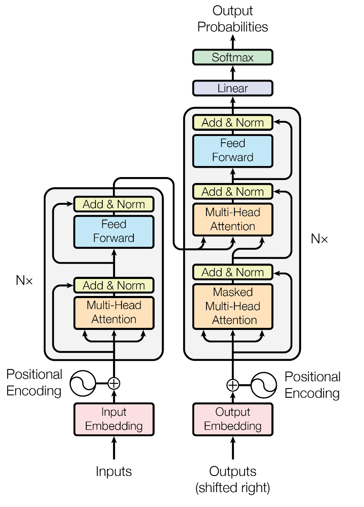

# Transformer Multi-Language Translator
A multi-language translator that utilizes the transformer neural network model described by the paper titled **Attention Is All You Need** in late 2017. A recently rising Natural Language Processing Model shown to often compete with and even out perform LSTMs and GRUs. This Translator uses the Transformer Model is its basis. This project has multiple languages trained. The limit currently are resources thus all languages are paired with English. Please refer the languages section below for more information. This translator has fairly good accuracy considering it was trained on downsized datasets due to resource limitations as well as low epochs. If you have the resources, then you may clone the REPO and train the model on larger datasets as well as more Epochs.

Reference to **Attention Is All You Need** Paper: https://arxiv.org/pdf/1706.03762.pdf

## Model

Currently, the transformer model is the state-of-the-art approach to a lot of major natural language processing tasks such machine translation and language modelling. The Transformer model can be split into two main components, the encoder and the decoder. 



### Encoder
The input is embedded using nn.Embedding to create an embedding vector to uniquely represent each word token as well as closely relate similar words. Positional encoding encodes a token based on the position in the input sequence instead of it's token value. The encoder outputs a sequence of context vectors. Unlike the RNN where the token being read is only influenced by the hiddens states of previous tokens, in the transformer model, each token is influenced by all tokens in the sequence. This also means that the entire input sentence can be processed simultaneously instead of word by word, allowing for much more parallelism. The transformer model in the original paper uses static embedding while current and state-of-the-art transformer NLP models such as BERT use dynamic or learnable positional embeddings. As such, we will use learnable position embeddings. After the input sequence is embedded, it is passed through the Multi-Head Attention layer, which is the promiment aspect of a transformer model. Multiheaded attention takes in a value, key, and query. The Query and key are multiplied and scaled before their product is multiplied by the value. This is known as Scaled Dot-Product Attention as seen in the Diagram Below.


Multi-Headed attention are multiple scaled dot-product attention layers stacked upon each other and concatenated, then passed through a dense layer. Multi-Headed attention allows the transformer model to jointly deal with multiple subspace representations from different positioned tokens.

### Decoder
The Decoder takes in the target value and applies token and positional encoding to it aswell. The decoder also contains a Multi-Head Attention layer, however the scaled dot-production attention layer in the Multi-Head Attention masks out all values that the softmax activation deems unnecessary or illegal, hence the name Masked Multi-Head Attention Layer. The output of the MMHAL is the query for the next regular Multi-Headed Attention while the key and value are the outputs from the encoder (encoded inputs). The decoder then passes the result through a Feed Forward Layer and then a classification Dense network for final predictions

## Training

### Organization of Data
Please refer to the dataset section for more details on the datasets I'm using. The data files I'm using for training are line-by-line text files meaning each line is training data. Each langauge file comes in pairs. For example, if I want to train the translator to work with English and French, the files I have are located in the ```data/french-english/``` directory and the files present ```english.txt``` and ```french.txt```. Thus, we have the file locations ```data/french-english/english.txt``` and ```data/french-english/french.txt```. This is the organization format I used in this project and the organization applies to all language pairs. Keep in mind, English, is usually the latter in the data/**language-language** directory name as you can see in the data directory.

Python Files
  - train.py
    - an executable python script that takes in parameters including hyperparameters for the transformer model as well as training paramters. While running, the programs save the model weights to a specified directory every epoch and displays training loss. Run this file as follows:
    ```
    python train.py --hyperparameters
    ```
    --hyperparameters are a list of hyperparameters to call in order to properly execute train.py. Each hyperparamter is to be entered in this format:
    ```
    --data_directory data
    ```
    followed by a space to seperate each hyperparameter entered. Please refer to the file to see specific hyperparamters. **NOTE: In order to train yourself, either download the proper tgz files in the datasets section below and correct the script parameters or use your own dataset and modify the train.py file to work with your dataset.**
    
  - translate.py
    - an executable python script that (assuming default hyperparameters) takes in the input text, input language, output language and returns the tranlation from the input language to the output language. For example, here is a test run:
    ```
    python translate.py --input_text "What is your name?" --input_lang english --output_lang french
    ```  
    This command will translate the text **"What is your name?"** to French.
    - To use tranlate.py correctly, the model weights and dictionary files must follow the following organization. In the saved_models directory, create a directory signifying the translation model (eg. english2french) and save the models that translate from english to french in said directory. Also save the dictionary files using pixel. **If your cloning this repo and don't want to train, then there is no need to do any of the steps above as all files are in place.** 
    
  - models.py
    - Contains the component classes to build a Transformer model and includes the Transformer Class. Also includes Feed-Forward Layer, Multi-Head Attention, Encoder Layers, Encoder, Decoder Layers, and Decoder.
    
  - dictionary.py
    - creates a Dictionary class which keeps track of all words seen from the dataset in each language and assigns a unique token to every new word.
    
  - utilities.py
    - contains utility functions to help with preprocessing and post processing data.
    
## Purely Testing
If you want to test the software without training or any other steps described above, then follow the following steps:

  - Step 1:
    - Clone the Repository.
  - Step 2: 
    - Ensure you have all the requirements necessary in the requirements.txt file. Main ones are Pytorch and other math libraries such as Numpy.
  - Step 3:
    - Run the python script **translate.py** and entering the hyperparameters **input_text, input_lang, output_lang**. For example,
      ```
      python translate.py --input_text "How is your day today?" --input_lang english --output_lang french
      ```  
      Here are the list of possible input -> output pairs:
        - English -> French
        - English -> German
        - English -> Italian
        - English -> Portuguese
        - French -> English
        - German -> English
        - Italian -> English
        - Portuguese -> English
    
## Datasets

For this project, the European Parliament Proceedings Parallel Corpus 1996-2011 is used. Note, the downloaded files are tgz files. In order to use them, please extract them and name them according to the format you see in this repo, including appropriately expanding names for convenient access. Link to dataset: https://www.statmt.org/europarl/

Reference to paper: http://homepages.inf.ed.ac.uk/pkoehn/publications/europarl.pdf
    
## Samples

Since I do not know many of the langauges I have trained on the Transformer model, I will be using more robust translators as comparison such as Google Translate.

### English -> French
**Input:** "it is important to know."  
**Prediction:** "il est important de savoir ."  
**Google Translate:** "il est important de savoir."  

**Input:** "what should I do?"  
**Prediction:** "que je devrais faire ?"  
**Google Translate:** "que devrais-je faire?"  

**Validation Datapoint from Dataset (Larger Sentence)**  
**Input:** "this debate and the amendment of the directive currently in force allow us to incorporate differentiating elements which demonstrate the diversity of this Europe of ours."  
**Prediction:** "ce debat et l amendement de la directive nous permet d integrer les elements qui demontrent la diversite de notre europe ."  
**Google Translate:** ce débat et l'amendement de la directive actuellement en vigueur nous permettent d'intégrer des éléments de différenciation qui démontrent la diversité de cette Europe qui est la nôtre."  
**Google Translate Back Translation of Prediction:** "this debate and the amendment of the directive allow us to integrate the elements which demonstrate the diversity of our europe."  

As you can see with the example above, the prediction may not be word to word with Google Translate results, but the prediction still maintains the semantic information and context that was in the input.

### English -> German
**Input:** "this is a short paragraph."  
**Prediction:** "das ist ein kurzer absatz ."  
**Google Translate:** "dies ist ein kurzer Absatz"  

**Input:** "what is your name?"  
**Prediction:** "was ist ihr name ?"  
**Google Translate:** "was ist ihr name?" 

### Italian -> English
**Input:** "oggi è una giornata bellissima."  
**Prediction:** "today is a magnificent day ."  
**Google Translate:** "today is a beautiful day."  

**Input:** "la collaborazione è la chiave del successo."  
**Prediction:** "cooperation is key to success ."  
**Google Translate:** "collaboration is the key to success."  

### Portuguese -> English
**Input:** "é importante cuidar de sua saúde mental."  
**Prediction:** "it is important to promote their mental health ."  
**Google Translate:** "it is important to take care of your mental health."  

**Input:** "você deve dormir uma boa quantidade de sono todos os dias."  
**Prediction:** "sleep a good amount of sleep every day ."  
**Google Translate:** "you should get a good amount of sleep every day."  
